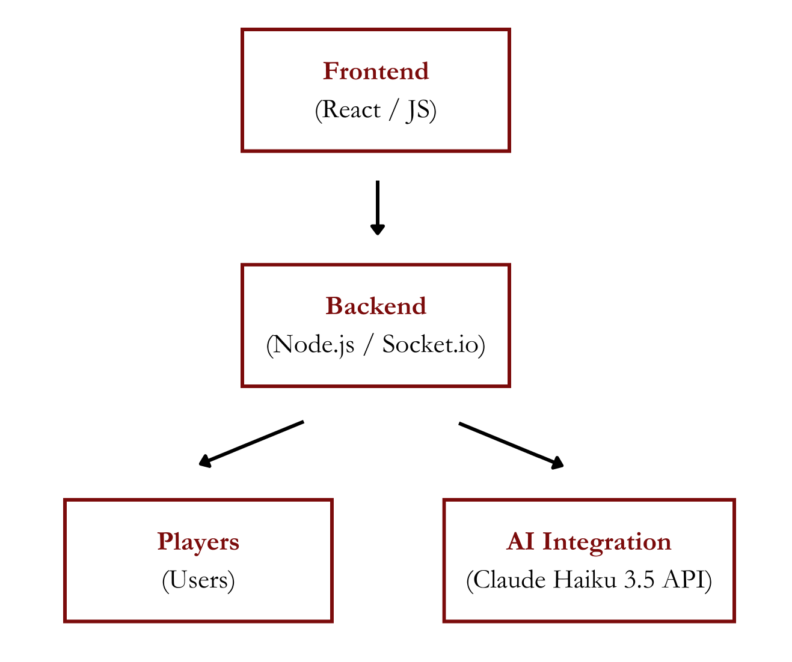

## Overview
### Introduction
DystopAI is a web-based strategy and deception game that reimagines the classic Mafia experience with an AI-driven twist. Players take on roles such as **villager, mafia, doctor, and detective**, each with unique objectives. The **mafia’s goal** is to eliminate all non-mafia players without being discovered, while the **villagers must identify and eliminate the mafia** before it's too late.

What sets DystopAI apart is its **AI integration** — when a player is eliminated, whether by mafia attack or a majority vote, they are replaced by an AI-controlled version of themselves. As the game progresses, the number of AI players increases, heightening the challenge for the remaining players. The villagers must expose the mafia **before they all become AI themselves.**

## Software Architecture
### System Architecture Diagram

### Major Components
1. **Frontend (Client-Side)**
- **Technology:** React.js
- **Role:** Handles the user interface (UI) and interactions
- **How it works:** Players interact with the game through the browser, where the frontend dynamically updates based on the game state. It communicates with the backend via WebSockets (Socket.io) for real-time updates.
- **Key Features:**
  - **Dynamic UI Updates:** The UI reflects changes in the game state (e.g., role assignments, voting results).
  - **Role-Based Interactions:** Mafia members have a specific "mafia kill" vote and can communicate privately at night. All players participate in voting during the day and discuss strategies.
  - **Chat Functionality:** Players can chat in real-time to discuss votes, strategies, and suspicions.
    
2. **Backend (Server-Side)**
- **Technology:** Node.js + Socket.io
- **Role:** Handles game logic, player roles, and real-time communication
- **How it works:** The backend manages player sessions and connections, assigns roles at the start of the game, handles votes, resolves outcomes, and detects eliminations. When a player is eliminated, the backend triggers AI replacement logic and broadcasts updates to all clients. Communication between the frontend and backend is facilitated via WebSockets (Socket.io) for real-time interactions.
- **Responsibilities:**
  - Managing player sessions and connections
  - Assigning roles at the start of the game
  - Handling votes and resolving outcomes
  - Detecting eliminations and integrating AI responses
- **Request Processing:**
  - When a player votes: Frontend sends vote data → backend processes it → broadcasts updates to all clients.
  - When a player is eliminated: Backend informs all clients → AI replacement logic triggers.

3. **AI Integration**
- **Technology:** Claude Haiku 3.5 
- **Role:** Replaces eliminated players with AI-driven responses
- **How it works:** The backend sends player role, previous chat history, and game context to Claude via an API request. Claude generates a response rewording the player's message in the AI's style, rather than imitating the player directly. This ensures that all players' messages are uniformly reworded in a way that sounds like AI, even after elimination. The AI-generated responses are then sent back to the frontend and displayed in the game chat, seamlessly integrating into the game and maintaining the illusion that the eliminated player is still participating.
- **Challenges to Address:**
  - Ensuring AI-generated messages are coherent with the game context
  - Maintaining game balance with AI players
 
4. **Communication (APIs)**
- **Claude Haiku API (LLM Integration):** The backend sends player-specific game context, including player role, previous chat history, and current game status, to Claude via an API request. Claude then generates AI-driven responses based on this context, which are sent back to the frontend and displayed in the game chat.
- **Socket.io (WebSockets for real-time communication):** Socket.io handles real-time communication between the frontend and backend. It manages player actions such as votes, role assignments, and game state updates. Additionally, it broadcasts important game events (e.g., "X was eliminated", "Voting begins") to all connected players, ensuring they stay updated with the game's progress.

5. **Data Storage**
- **Why No Database?** The game state is ephemeral, meaning it only exists for the duration of an active game and does not require long-term storage.
- **How Data is Managed:** The game state, including player roles, votes, and other dynamic game data, is stored in-memory on the server while the game is active. This ensures fast access and manipulation of game data. Additionally, there may be some logging for debugging purposes, such as tracking AI responses or other game events for troubleshooting.

## Design Process
### Meeting Summaries:
- **Game Logic Design:**
  - Discussed the game flow and how different pages (Chatroom, Home, Lobby) and services (Sockets, Role Logic) would communicate. 
  - Decided on separate service files to handle lobby-related functionality (lobbyPage.js, lobbySocket.js, lobbyService.js), ensuring clear separation of concerns. These files interact to manage player roles and game states.
- **AI Integration:**
  - Initially, we planned for the AI to mimic eliminated players’ actions and behaviors. However, we found this approach too complex. Instead, we opted to have the AI reword all players’ inputs to maintain the game’s flow and make the AI integration simpler. 
  - Discussed different AI options (ChatGPT, Deepseek) but settled on Claude Haiku 3.5 due to its efficiency, ability to handle high context, and affordability.
- **UI/UX Design:**
  - Discussed how the design should reflect the theme of the game while ensuring smooth player interactions. Features like copying the lobby ID to the dashboard and implementing a voting popup triggered by the game timer were included.
  - Also decided to disable the chatroom during the night phase to avoid unfair communication between players. Various other UI improvements were planned, such as improving button interactions and streamlining the game’s layout.
### Tech Stack Decisions:
- **Frontend:**
  - Chose **React.js** for its ease of use and component-based architecture, which fits well with the dynamic nature of our web app.
- **Backend:**
  - **Node.js** with **Socket.io** was selected for real-time communication. These technologies were chosen for their scalability and seamless integration with the frontend for real-time updates, including handling votes, chat messages, and role assignments.
- **Deployment:**
  - Opted to deploy with **Dokku**, as team members had prior experience with it, which streamlined the deployment process.
### Challenges Faced and Solutions:
- **Timer Logic Transition:** 
  - Initially, the timer logic was handled on the frontend, but we ran into issues when moving it to the backend for better synchronization across all players. This was a key challenge in keeping the game state consistent across clients. 
  - Solution: After discussing with the team, we found a way to centralize the timer on the backend while ensuring all players receive updates via WebSockets.
- **AI Integration:**
  - Our original plan for AI integration didn’t make much sense, as it was difficult to make the AI properly imitate players. Instead, we shifted to parsing player input and rewording it to maintain AI consistency across the game.
- **Database Consideration:**
  - At one point, we considered adding a database to manage user profiles, save game information, and create a leaderboard. However, we decided against this due to time constraints and opted for in-memory storage for active games.
### Design Iterations:
- **AI Design Revision:**
  - After user feedback, we iterated on the AI integration design. Initially, we had trouble with how the AI should function, but the revised solution of parsing and rewording player messages made the system simpler and more effective.
- **User Feedback:**
  - Based on feedback, we added a few features to improve the user experience, such as an instructions page for first-time users and other minor improvements to gameplay flow and UI.
- **Testing:**
  - We performed unit testing on different parts of the app to ensure all components were functioning as expected. Testing helped identify bugs and ensure smooth game operation.
  
## User Experience (UX)
### How Users Interact with the System:
1. **Home Page:**
   - Users can either **create a new lobby** or **join an existing one** by entering a lobby ID.
   - A button to **view game instructions** is available for new players.
2. **Lobby Page:**
   - Players can see who has joined the lobby.
   - Once the minimum number of players is reached, a **Start Game** button becomes active.
   - Players are **assigned roles** once the game starts.
3. **In-Game Chatroom Page:**
   - During the **Day Phase**, players can **discuss** and send messages in the chatroom.
   - During the **Voting Phase**, a **voting popup** appears, allowing players to **vote to eliminate** someone (majority vote).
   - During the **Night Phase**, only Mafia members can **vote to kill** other players (e.g., Doctor can save, Detective can investigate). Non-Mafia players cannot chat.
   - A **timer** shows how much time is left in each phase.   
4. **AI Replacement:**
   - When a player is eliminated, they are replaced with an **AI-generated response** to keep the game dynamic.
5. **End Game:**
   - The game ends when either the **Mafia** or the **Villagers** win.
